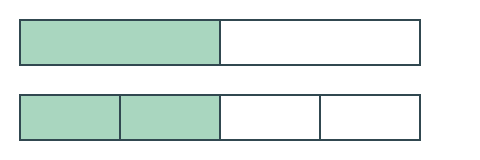

## Gesprächsimpuls

Was ist gleich geblieben, obwohl mehr Teilstücke zu sehen sind?

## Beispiel

$$
\frac{1}{2}=\frac{2}{4}
$$

Die Liste „Benötigtes Material“ wird aus `stunde.toml` vor diesem Inhalt
angezeigt. Sie muss nicht zusätzlich in dieser Datei gepflegt werden.
